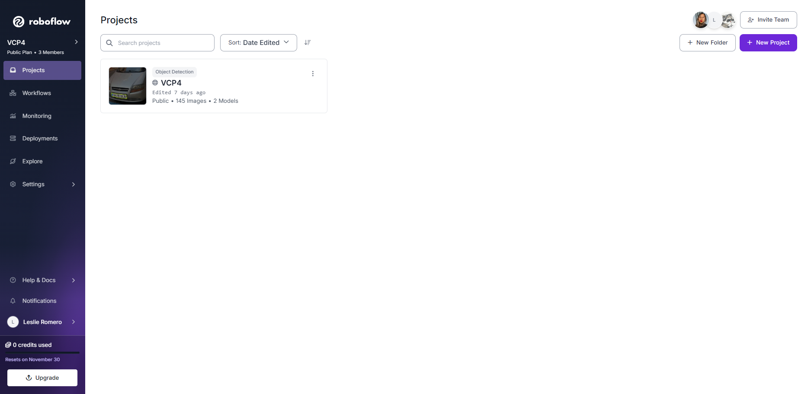
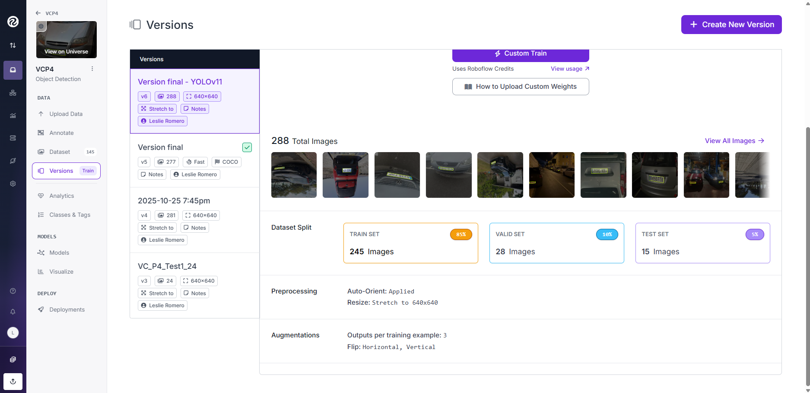
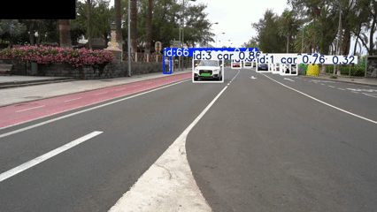
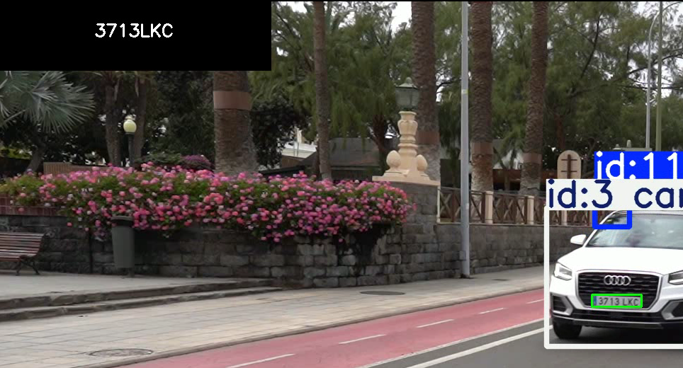

# Práctica 4 de VC (Visión por Computador)

## Autores

Leslie Liu Romero Martín
<br>
María Cabrera Vérgez

## Tareas realizadas

Para la entrega de esta práctica, la tarea consiste en desarrollar un prototipo que procese uno (vídeo ejemplo proporcionado o varios vídeos (incluyendo vídeos de cosecha propia)):

- detecte y siga las personas y vehículos presentes
- detecte las matrículas de los vehículos presentes
- cuente el total de cada clase
- vuelque a disco un vídeo que visualice los resultados
- genere un archivo csv con el resultado de la detección y seguimiento. Se sugiere un formato con al menos los siguientes campos:
	* fotograma
	* tipo_objeto
	* confianza
	* identificador_tracking
	* x1
	* y1
	* x2
	* y2
	* matrícula_en_su_caso
	* confianza
	* mx1
	* my1
	* mx2
	* my2
	* texto_matricula

## Instalación

``` python
import csv
import math
import os

import cv2
import easyocr
import numpy as np
import pytesseract
import torch
from IPython.display import Video, display
from matplotlib import pyplot as plt
from PIL import Image
from pytesseract import Output
from transformers import AutoProcessor, AutoModelForImageTextToText
from ultralytics import YOLO
```
## Tareas

### Entrenamiento del modelo

Con respecto al entrenamiento del modelo, nosotras hemos decidido usar Roboflow ya que facilitaba el proceso bastante. Comenzamos con el dataset que pudimos recopilar entre todos los compañeros, previa prueba con un dataset mucho más pequeño para comprender el funcionamiento de Roboflow.

Insertamos todas las imágenes en Roboflow (sin "*augmentation*") y manualmente, a través de la interfaz gráfica de Roboflow, nos encargamos de etiquetar las 145 imágenes. 



Para generar el dataset que usaríamos para entrenar a nuestro modelo de YOLO, creamos una nueva versión y le asignamos parámetros como el *preprocessing*, el tipo de *augmentation* que le queremos aplicar,  y las proporciones para entrenamiento, validación y testing. En nuestro caso, nosotras nos mantuvimos en el rango 70-20-10 que suele ser estándar.



Una vez teníamos la versión creada, exportamos el dataset mediante el "code snippet" que te proporciona Roboflow, previamente habiendo elegido YOLO11 como nuestro modelo para entrenar. Este "code snippet" lo ejecutamos dentro de Google Colab para poder entrenar al modelo de YOLO, ya que nignuno de nuestros ordenadores tenía las especificaciones necesarias para ello. El resultado es un archivo .pt que contiene los pesos que utiliza YOLO para detectar, en este caso, matrículas. El archivo correspondiente `best.pt` es el que utilizamos como nuestro modelo en el código.

```python
OUR_MODEL_PATH = 'best.pt'
our_model = YOLO(OUR_MODEL_PATH)
```

### Implementación conjunta (modelo pre-entrenado y el nuestro)

Para implementar la parte principal de la práctica: utilizar el modelo pre-entrenado de YOLO y el nuestro para detectar personas, coches y matrículas, se encuentra implementado en la siguiente parte del código:
```python
while vid.isOpened():
    ret, frame = vid.read()
    frame_count += 1

    if ret:
        base_results = base_model.track(frame, persist=True, show=False, classes=classes)
        plates_result = None
        annotated_frame = base_results[0].plot()
        boxes = list()

        # Mostramos un recuadro arriba a la izquierda que muestre las matrículas que se vayan detectando
        text_box_w = int(frame.shape[1]*0.2)
        text_box_h = int(frame.shape[0]*0.09)
        
        cv2.rectangle(annotated_frame, (0, 0), (text_box_w, text_box_h), (0, 0, 0), -1)

        last_plate = ""
        show_plate_text = ""
        
        for result in base_results:
            boxes += result.boxes
        for box in boxes:
            bounding_box = box.xyxy.tolist()
            name = result[0].names[box.cls.int().item()]
            conf = box.conf
            track_id = str(int(box.id[0].tolist()))
            if track_id not in track_ids:
                track_ids.add(track_id)
                count_classes[name] += 1
            x1, y1, x2, y2 = [int(item) for item in bounding_box[0]]
            plate, plate_conf, px1, py1, px2, py2, plate_text = "", "", "", "", "", "", ""
            if name != "person":
                vehicle_box = frame[y1:y2, x1:x2]
                plates_result = our_model(vehicle_box, show=False)
                if len(plates_result[0].boxes) > 0:
                    plate_conf = plates_result[0].boxes.conf
                    plate_detection = (plates_result[0].boxes.xyxy).tolist()
                    px1, py1, px2, py2 = [int(item) for item in plate_detection[0]]
                    plate = vehicle_box[py1:py2, px1:px2]
                    real_x1 = px1+x1
                    real_y1 = py1+y1
                    real_x2 = px2+x1
                    real_y2 = py2+y1
                    cv2.rectangle(annotated_frame, (real_x1, real_y1), (real_x2, real_y2), (0, 255, 0), 2)
                    plate_text = ocr_easy(plate, frame, real_x1, real_y1)
                    plate_text = plate_text.strip()
                    if plate_text is not None:
                        show_plate_text = plate_text
            save_csv.append(["frame", name, conf, track_id, x1, y1, x2, y2, "plate", plate_conf, px1, py1, px2, py2, plate_text])
            if show_plate_text != last_plate:
                font = cv2.FONT_HERSHEY_SIMPLEX
                (text_width, text_height), baseline = cv2.getTextSize(plate_text, font, 0.8, 2)
                text_x = (text_box_w - text_width) // 2
                text_y = (text_box_h + text_height) // 2 - baseline
                cv2.putText(annotated_frame, plate_text, (text_x, text_y), font, 0.8, (255, 255, 255), 2)
                last_plate = show_plate_text               
            
        out.write(annotated_frame)
    else:
        # El vídeo ya se terminó
        break
```
Como se puede ver, procesamos cada frame del vídeo mediante OpenCV, le aplicamos el modelo base para detectar personas y vehículos, teniendo en cuenta incluir track() para que se realice el seguimiento y filtrar por clases para que solo detecte personas y vehículos que puedan contener matrículas, procesamos los resultados del modelo base para seguir al siguiente escalón, nuestro modelo entrenado para matrículas.

Sin embargo, antes de pasarle el vehículo al modelo detector de matrículas, nos encargamos de realizar ciertos cálculos para extraer la "bounding box" del vehículo, el ID de la detección para su uso posterior en el conteo y otros datos para el CSV. Tras este proceso, comprobamos que se trata de un vehículo antes de llamar a nuestro modelo, y si lo es, le pasamos la "bounding box" que contiene al vehículo detectado para identificar su matrícula. Nuestro modelo nos devuelve una respuesta similar al modelo base, por lo que le realizamos cálculos similares para obtener la matrícula y los datos necesarios para el CSV y para dibujar la detección sobre el frame. 



Finalmente, esta matrícula pasa por la función de OCR correspondiente, ya sea la de easyOCR or la del VLM y, tras cierto "pre-processing" para facilitar la lectura, se obtiene el texto de la matrícula acorde a los modelos de OCR utilizados. 

El último paso es guardar todos los datos recopilados en el archivo CSV y escribir el frame en el vídeo que se guardará en disco para su posterior visualización. 

Con respecto a los añadidos, podemos ver algunas líneas que realizan ciertas funcionalidades extras como añadir un cajón de texto en la parte superior izquierda para mostrar la última matrícula en función de si se ha detectado una nueva o no.



### OCR

Para leer el texto de las placas, uno de los modelos usados ha sido EasyOCR, un modelo de python para extraer texto de imágenes (en este caso, de los frames de un vídeo). Para poder analizar cómodamente el vídeo, se generan unas imágenes recortadas, obtenidas a partir de las coordenadas del bouding box.

``` python
x1m = max(0, x1 - margin)
y1m = max(0, y1 - margin)
x2m = min(frame.shape[1], x2 + margin)
y2m = min(frame.shape[0], y2 + margin)
placa_crop = frame[y1m:y2m, x1m:x2m]
```

Si se ha generado una imagen recortada, si esta tiene píxeles, y por lo tanto no está vacía, se aumentará el tamaño de la imagen para que el OCR intente leerlo y se va a procurar que tenga buena calidad a pesar de la redimensión.

``` python
escala = 3
placa_crop = cv2.resize(placa_crop, None, fx=escala, fy=escala, interpolation=cv2.INTER_CUBIC)
```

< inserte imagen con la redimensión, ejemplo de crop >

A continuación y con el objetivo de simplificar el futuro procesamiento de la imagen para su lectura, se aplican algunos filtros. Entre ellos está convertir la imagen de una escala BGR (blue, green, red) a gris. Se aplica una ecualización de histograma a la imagen generada. El motivo de ello es mejorar el contraste de la imagen, facilitar el trabajo del OCR y que no confunda el fondo con el texto a leer.

``` python
gray = cv2.cvtColor(placa_crop, cv2.COLOR_BGR2GRAY)
gray = cv2.equalizeHist(gray)
gray = cv2.convertScaleAbs(gray, alpha=1.5, beta=0)
```

Se procede a aplicar el OCR en la imagen con el filtro gris. Los otros parámetros que se le pasan son los caracteres permitidos dentro de una matrículas (todo el abecedario en mayúsculas y los número del 0-9). Por último, detail = 1 indica que todos los elementos de la lista de resultados tendrá la forma [coordenadas, texto, confianza].

``` python
ocr_result = reader.readtext(
    gray,
    allowlist='ABCDEFGHIJKLMNOPQRSTUVWXYZ0123456789',
    detail=1,
    text_threshold=0.2
)
```

Si se ha generado algún resultado (porque puede pasar que al inicio no se detecte ninguna matrícula), se guardará el texto por un lado, eliminando los espacios en blancos por medio de .strip(). En una variable llamada "prob" se guardará la confianza del OCR. Se toma ocr_result[0] porque será la matrícula principal en ese momento.

``` python
if len(ocr_result) > 0:
    text = ocr_result[0][1].strip()
    prob = ocr_result[0][2]
```

Puede pasar que el OCR genere matrículas donde solo detecta una letra. Para ello, se le ponen ciertas condiciones. Por un lado, que la matrícula debe tener como poco 4 caracteres. La probabilidad debe ser mayor al 50 % (0'5) y que el texto a analizar sea diferente al último guardado (por tratar de evitar guardar la misma matrículas varias veces por los diversos frames).

Se obtiene el tiempo en segundos del frame que captó la matrícula y se imprime, indicando su confianza. Además, se ilustra encima del propio vídeo, colocando por el tiempo que permita la matrícula dentro del vídeo. Se sitúa, indica la fuente, el tamaño, el color, grosor. Se devuelve el texto captado.

``` python
if len(ocr_result) > 0:
    text = ocr_result[0][1].strip()
    prob = ocr_result[0][2]
        if len(text) >= 4 and prob > 0.5 and text != last_plate:
            last_plate = text
            timestamp = vid.get(cv2.CAP_PROP_POS_MSEC) / 1000
            print(f"[{timestamp:.2f}s] Matrícula: {text} (Conf: {prob:.2f})")
            cv2.putText(frame, f'{text}', (x1, y1 - 10),
                        cv2.FONT_HERSHEY_SIMPLEX, 0.8, (0, 255, 0), 2, cv2.LINE_AA)

return text
```

### SmolVLM

En cuanto a modelos de lenguaje visual, se ha optado por usar SmolVLM. Lo primero es elegir el dispositivo que se usará para que el modelo se ejecute. En este caso, no se cuenta en ninguno de los ordenadores con una gpu (para ello se ha usado google colab, yendo más rápido), se usará una cpu, que es más lenta. Se descarga el procesador y se carga el modelo SmolVLM-Instruct. Luego, se pasa al dispositivo antes definido.

``` python
device = "cpu"  # or "cpu"

processor = AutoProcessor.from_pretrained("HuggingFaceTB/SmolVLM-Instruct")
model = AutoModelForImageTextToText.from_pretrained("HuggingFaceTB/SmolVLM-Instruct",
                                                dtype=torch.bfloat16,
                                                _attn_implementation="flash_attention_2" if device == "cuda" else "eager").to(device)
```

En la función para implementar SmolVLM, pasamos como parámetros el recorte realizado para ver la imagen de la matrícula, el frame y las coordenadas del rectángulo. El procesador Hugging Face espera imágenes de tipo Pil.Image en RGB, pero la imagen pasada en BGR (OpenCV). Por ello, se debe convertir a RGB.

``` python
plate_img = Image.fromarray(cv2.cvtColor(crop, cv2.COLOR_BGR2RGB))
```

Se crea una lista de mensajes, como si se estuviera hablando con el modelo. Se procesa la entrada. Primero se convierte el mensaje al formato debido y se preparan los tensores. Estos serán enviados a la CPU debido a '.to(device)'.

``` python
generated_ids = model.generate(**inputs, max_new_tokens=10)
generated_texts = processor.batch_decode(generated_ids, skip_special_tokens=True)
```

Como no se está entrenando (solo leyendo), se desactiva el cálculo de gradientes. Se lee la matrícula usando model.generate y se pone un límite al tamaño de la matrícula o a veces se pueden volver loco el modelo y devolver matrícula demasiado largas y que no encajan con una real. Los ids generados se convierten en texto que se pueda entender y se quitan espacios y tokens especiales.

``` python
with torch.no_grad():
        generated_ids = model.generate(**inputs, max_new_tokens=10)
        generated_texts = processor.batch_decode(generated_ids, skip_special_tokens=True)
        plate_text = generated_texts[0].strip()
```

Se coge solo el texto que contiene la matrícula, puesto que sino, en pantalla aparecen líneas largas y no se aprecian las matrículas.

```python
if "Assistant: " in plate_text:
            raw_text = plate_text.split("Assistant: ")[1]
        else:
            plate_text = raw_text
```

Por último, se dibuja un rectángulo verde encima de la matrícula y se escribe el texto guardado por encima para que pueda se apreciado por pantalla. Se devuelve la lectura, puesto que la matrícula debe ser guardada en el csv.


### Guardar datos en csv

Para guardar los datos dentro de un csv, se ha hecho uso de la función del mismo nombre. Se pasa una lista de listas con los siguientes datos formando las columnas: 

* fotograma: frame del vídeo
* tipo_objeto: clase del objeto detectado 
* confianza: confianza de la detección (entre 0 y 1)
* id_tracking: id
* x1: coordenada del bounding box
* y1: coordenada del bounding box
* x2: coordenada del bounding box
* y2: coordenada del bounding box
* matrícula_en_su_caso: Indica si se detectó una matrícula
* conf_ocr: confianza del ocr
* mx1: coordenada del bounding box de la matrícula
* my1: coordenada del bounding box de la matrícula
* mx2: coordenada del bounding box de la matrícula
* my2: coordenada del bounding box de la matrícula
* texto_matricula: texto captado

``` python
columnas = [
    "fotograma", "tipo_objeto", "confianza", "id_tracking",
    "x1", "y1", "x2", "y2",
    "matricula_detectada", "conf_ocr",
    "mx1", "my1", "mx2", "my2",
    "texto_matricula"
]
```

Se abre el archivo en modo escritura (resultado.csv) para poner añadir los nuevos datos. Se va escribiendo por filas, usando ';' como separador, esto debido a que Excel reconoce así la separación entre columnas. Se escriben los encabezados y luego los datos. Por último, se envía un mensaje avisando al usuario de que el archivo ya ha sido generado.

### Comparativa de modelos

Como última tarea, hicimos una pequeña comparativa utilizando parte del dataset de entrenamiento con los dos modelos de OCR con los que hemos decidido trabajar (EasyOCR, SmolVLM). Elegimos las imágenes de manera que se pudiesen hacer los cálculos lo más rápido posible, por lo que imágenes que no fueran del formato JPG o JPEG o que contuviesen más de una matrícula, se descartaron para los fines de este apartado. En total, nos quedamos con 50 imágenes con las que probar (también por tiempo de ejecución).

En cuanto a la implementación, tendremos la parte de lectura de las imágenes que cumplan las condiciones mencionadas:
```python
image_files = [
    f for f in os.listdir(PATH)
    if f.lower().endswith((".jpg", ".jpeg"))
]
```
Asimismo, nos aprovechamos de que los nombres de las imágenes contenían el texto de la matrícula que se encontraba en ellas (label):
```python
for img_name in tqdm(image_files, desc="Procesamiento de matrículas"):
    img_path = os.path.join(PATH, img_name)
    label = os.path.splitext(img_name)[0].upper()
```

Le pasamos la imagen a nuestro modelo detector de matrículas (evitamos usar el modelo general ya que se trata de un análisis no tan exhaustivo):
```python
OUR_MODEL_PATH = 'best.pt'
result = our_model(frame, show=False)
plate = result[0].boxes.xyxy.tolist()
x1, y1, x2, y2 = [int(item) for item in plate[0]]
```

Ahora solo queda calcular las métricas deseadas con los dos modelos (aprovechamos la implementación de ambos modelos que se encuentra en celdas anteriores):
```python
start = time.time()
try:
    text_vlm = ocr_vlm(plate, frame, x1, y1, x2, y2)
except Exception as e:
    text_vlm = ""
time_vlm += time.time() - start
if text_vlm and text_vlm.strip().replace(" ", "").upper() == label:
    correct_vlm += 1

start = time.time()
try:
    text_easy = ocr_easy(frame, frame, x1, y1)
except Exception as e:
    print(f"[EasyOCR error on {img_name}]: {e}")
    text_easy = ""
time_easy += time.time() - start
if text_easy and text_easy.strip().replace(" ", "").upper() == label:
    correct_easy += 1
```
Para cada modelo se calcula el tiempo de inferencia (timepo que tarda en detectar el texto) y si el modelo acertó o no con respecto a la realidad.

Finalmente, mostramos las métricas calculadas para poder tener una idea de cuál de los modelos obtiene mejores resultados.
```python
print("\n=== COMPARATIVA DE MODELOS ===")
print(f"Número de imágenes probadas: {total}")
print(f"SmolVLM (aciertos): {correct_vlm} / {total} ({correct_vlm / total:.2%})")
print(f"EasyOCR (aciertos): {correct_easy} / {total} ({correct_easy / total:.2%})")

print("\n=== TIEMPO MEDIO DE INFERENCIA ===")
print(f"SmolVLM: {avg_time_vlm:.3f} s/img")
print(f"EasyOCR: {avg_time_easy:.3f} s/img")
```